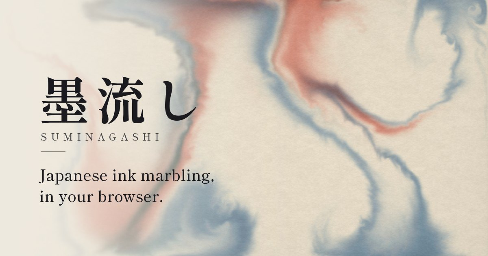

# Suminagashi 墨流し

[](https://github.com/MarinovM03/suminagashi/actions/workflows/ci.yml)

**Try it at [suminagashi.app](https://suminagashi.app)**

[](https://suminagashi.app)

An interactive simulation of *suminagashi* (墨流し, "floating ink"), the
centuries-old Japanese art of marbling paper with ink floated on still water.
Drop ink, swirl it, comb it into feathered waves, then save or share the result.
It runs in any modern browser, on phones and desktops.

## Features

- **Brush** draws ink that feeds with stroke speed, so it spreads on the water
  instead of saturating. Hovering stirs the water; every finger paints its own
  stroke on touch screens.
- **Rings**: press and hold to grow concentric rings from alternating drops of
  ink and water, the classic suminagashi technique.
- **Comb**: drag a row of tines through floating ink to feather it.
- **Four palettes** (Traditional, Ebru, Sunset, Neon), each with a cycle mode
  that uses the next ink on every touch.
- **Photo and video**: capture the marble as a PNG or record the flowing ink as
  an MP4 (WebM where MP4 recording isn't supported), then share it straight to
  other apps on phones.
- **Tune** the water live (ink flow, swirl, fade, force), **Auto flow** for drops
  and currents while you rest, **Wash**, and one-step **Undo**.
- **Built for phones**: a compact touch layout, fullscreen mode, and
  "Add to Home Screen" support. Slow devices switch to a lighter simulation.
- **Keyboard**: `Space` drops ink, `X` washes, `S` saves a PNG, `Ctrl`/`⌘`+`Z`
  undoes, `H` hides the controls.

## How it works

- **Fluid solver**: Jos Stam's *Stable Fluids* running entirely on the GPU
  (advection, vorticity confinement, pressure projection) with Three.js and
  ping-pong half-float render targets.
- **Subtractive ink**: the dye field stores *absorbance*, not color, and the
  display composites `paper × exp(−A)` (Beer–Lambert), so overlapping inks darken
  like real pigment on paper instead of glowing like screen colors.

## Running locally

```bash
npm install
npm run dev
```

`npm run build` writes a static site to `dist/`. `npm test` and `npm run lint`
run the checks that CI runs.

## Deploying

The site is fully static, with no server, database or accounts, so any static
host works. Set `SITE_URL` to the public address at build time; it fills in the
canonical and social-preview links, `robots.txt` and `sitemap.xml`.

`firestore.rules` is a deny-all placeholder that keeps the unused Firebase
project locked while the community gallery is shelved.

## Credits

Built with React, TypeScript, Vite and Three.js. The fluid solver is derived from
Pavel Dobryakov's [WebGL Fluid Simulation](https://github.com/PavelDoGreat/WebGL-Fluid-Simulation),
and the typeface is [Shippori Mincho](https://github.com/fontdasu/ShipporiMincho).
See [THIRD_PARTY_NOTICES.md](THIRD_PARTY_NOTICES.md) for their licenses.

Released under the [MIT License](LICENSE).

## Roadmap

- [ ] Community gallery with moderation: publish, browse and share marbles.
      An earlier prototype lives in the git history and will be rebuilt.
